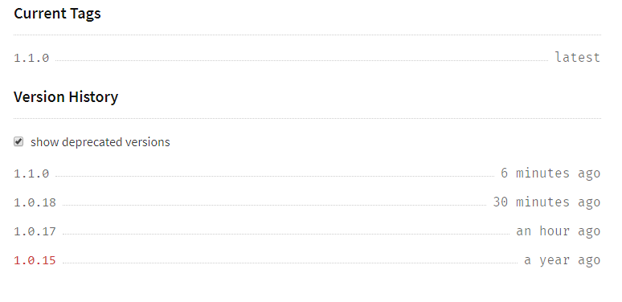

# Feby

Playground npm package for experiments with NPM packages development process using [NPM Registry](https://docs.npmjs.com/misc/registry). Created in February, 2017, that is why "Feby".

[](https://badge.fury.io/js/feby)
[](https://travis-ci.org/alundiak/feby)
[](https://circleci.com/gh/alundiak/feby)

## [Add user / Login](https://docs.npmjs.com/cli/adduser)
```
npm login
```
then provide username, password, and email. NPM will store info, and [`npm whoami`](https://docs.npmjs.com/cli/whoami) should work - return username.


## [Version](https://docs.npmjs.com/cli/version)
```
npm version patch
```
will increase `version` field value in `package.json`, and commit file. Eg. `1.0.15` will be changed to `1.0.16`. `minor`, `major` are also available.

Also git tag will be created. So next `git push origin master --tags` will push tags also.

And when `npm publish` executed, then new version/release will be published to NPM registry.


## [Publish](https://docs.npmjs.com/cli/publish)

Doesn't work:
```
npm publish feby
```

First time you need to:
```
npm publish --access public
```

And all future times:
```
npm publish
```

## Unpublish

```
npm unpublish feby@1.0.7
npm unpublish feby@1.0.8
```

Note: If only one valid version used, that version can be unpublished as above command.
Need to publish new version, and then unpublish previous, but might be needed to deprecate first:

```
$ npm unpublish feby@1.0.15
npm ERR! unpublish Failed to update data
npm ERR! code E400
npm ERR! You can no longer unpublish this version. Please deprecate it instead
npm ERR! npm deprecate feby@1.0.15 "this version has been deprecated" : 23-6b802899cf4e380475450040dee99124
```

## Deprecate

```
$ npm deprecate feby@1.0.15
npm ERR! Usage: npm deprecate <pkg>[@<version>] <message>

$ npm deprecate feby@1.0.15 "old version"
$ npm deprecate feby@1.0.17 "old version"
$ npm unpublish feby@1.0.17
$ npm unpublish feby@1.0.18
```

Not sure how should this work properly.

Example of versions list on npmjs.com:




## Remove tags

```
git tag -d 1.0.7 && git push origin :refs/tags/1.0.7
git tag -d 1.0.8 && git push origin :refs/tags/1.0.8
```

## Publish to custom NMP registry

### [NPM Token](https://docs.npmjs.com/getting-started/working_with_tokens)

When package is ready to publish, NPM user should be logged in, and NPM should have tokens generated.

Look to `~/.npmrc` file or run command `npm token list`:

```
┌────────┬─────────┬────────────┬──────────┬────────────────┐
│ id     │ token   │ created    │ readonly │ CIDR whitelist │
├────────┼─────────┼────────────┼──────────┼────────────────┤
│ 8a0b90 │ 3bbc39… │ 2018-07-04 │ no       │                │
├────────┼─────────┼────────────┼──────────┼────────────────┤
│ fd81e6 │ 283fec… │ 2018-07-04 │ no       │                │
├────────┼─────────┼────────────┼──────────┼────────────────┤
│ 57700d │ e0bf40… │ 2018-03-15 │ no       │                │
└────────┴─────────┴────────────┴──────────┴────────────────┘
```

Note:
- `3bbc39...` is token generated by NodeJS `v8.1.12` / npm `v5.6.0` at my work machine.
- `283fec...` is token generated by NodeJS `v10.4.0` / npm `v.61.0` on my home machine.
- `e0bf40...` no idea, but some old token, generated time ago, in March 2018, when I played/tried with `feby` republish.

There is manual approach to create TOKEN via `npm token create`, which asks ONLY for "npm password" and returns information about token:

```
 ┌────────────────┬──────────────────────────────────────┐
 │ token          │ 7f899...                             │
 ├────────────────┼──────────────────────────────────────┤
 │ cidr_whitelist │                                      │
 ├────────────────┼──────────────────────────────────────┤
 │ readonly       │ false                                │
 ├────────────────┼──────────────────────────────────────┤
 │ created        │ 2018-07-04T16:01:29.041Z             │
 └────────────────┴──────────────────────────────────────┘
```

And `npm token list` now will show more tokens. And `npm token delete 57700d` will delete (invalidate) token from list.


### [.npmrc](https://docs.npmjs.com/files/npmrc)

Important to know, the format of content is `key=value`. Since maybe NodeJS 6, it's a standard:

```
init.author.name=Andrii Lundiak
strict-ssl=false
always-auth=false
user-agent="npm/6.1.0 node/v10.4.0 linux x64"
etc=abc
//custom-nexus.com/repository/my-hosted-npm-registry/:_authToken=NpmToken.11e11003-****-c104c0ce466f
//registry.npmjs.org/:_authToken=4bac39b2-****-ec668f28176c
```

But special format is for storing auth/token information:

* prepend by double forward slashes `//` at the start and
* important to have one `/` at the end of registry url (otherwise NPM will not recognize it as registry and will throw `ENEEDAUTH` or similar error.).
* then `:_authToken=` and then,
* I personally guess, that auth token value depends on kind of NPM registry.
    * If regular/official registry, then `_authToken=` regular UUID value.
    * But for Nexus Manager based NPM registry, it's prepended with `NpmToken.`.

### NPM auth on CI

As turned out, `_authToken` as piece of authentication line in `.npmrc` file is created/used when NPM works locally, or anyhow but using `npm adduser/login`.

But, there is `_auth` dedicated field/key, which is expected to be `base64` value of encoded pair `username:password`.

[Here](https://help.sonatype.com/repomanager3/node-packaged-modules-and-npm-registries#NodePackagedModulesandnpmRegistries-AuthenticationUsingBasicAuth) and [here](https://github.com/workshopper/how-to-npm/issues/25#issuecomment-388861931) are mentioned how to use this approach on CI.

* `echo -n 'admin:admin123' | openssl base64` and then use base64 value in:
* `.npmrc` file content for dedicated field/key `_auth`:

```
email=you@example.com ; required
always-auth=true ; optional
_auth=YWRtaW46YWRtaW4xMjM=  ; required
```

Having such setup in `.npmrc` file, CI (Jenkins, Bamboo) can authentication every future npm commands like whoami, token, publsish, search.

### CI & Token Related info:
- https://docs.npmjs.com/private-modules/ci-server-config
- https://www.npmjs.com/package/npm-profile
- https://www.npmjs.com/package/npm-cli-login
- https://github.com/npm/npm-registry-client
- https://issues.jenkins-ci.org/browse/JENKINS-45854
- https://github.com/npm/npm/issues/12111

## Resources

- https://blog.npmjs.org/post/184553141742/easy-automatic-npm-publishes